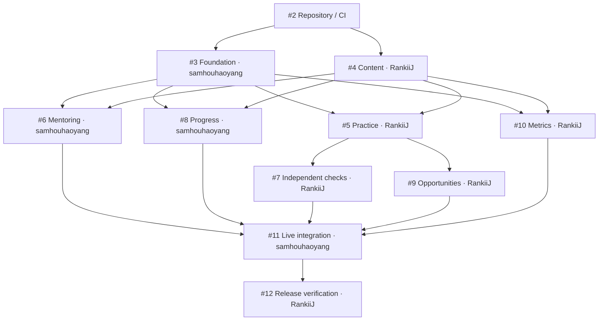

# Parallel delivery

`@samhouhaoyang` owns foundation, mentoring, progress, and integration. `@RankiiJ` owns content, the learner flow, opportunities, metrics, and release verification. Each story has one owner; the other developer reviews it. The user confirmed this assignment.

The machine-readable [backlog](backlog.json) contains the exact scope, owner, reviewer, branch, allowed paths, acceptance criteria, and prerequisite IDs. Published GitHub issue numbers and native relationships are recorded there. GitHub issues are the live work tracker; the manifest is the reviewed planning snapshot and CI guard against dependency/ownership mistakes.

## Work sequence

| Round | @samhouhaoyang | @RankiiJ | Gate |
| --- | --- | --- | --- |
| Setup | Shared repository, CI, and issue graph | Review the baseline | SETUP completed |
| Start together | FOUNDATION: runnable shell, stable interfaces, runtime | CONTENT: reviewed JSON cases, seeds, standalone validator | Both use [contract v1](contracts.md) |
| Features | MENTOR: help → reply → published card | PRACTICE: WK-01 judgment → reveal → review | FOUNDATION and CONTENT merged and closed |
| Continue independently | PROGRESS: evidence → explained support change/review | CHECKS: fresh TR-01 and exposure; then OPPORTUNITIES and METRICS | Follow each issue's actual blockers |
| Integrate | INTEGRATION: compose the real end-to-end path | Peer review and fix learner/metrics defects | All five required feature branches merged |
| Release | Review and coordinate hosting/local fallback | RELEASE: accessibility, rehearsal, delivery evidence | INTEGRATION complete |

The table suggests an order within each person's workload; only declared native blockers are hard prerequisites. For example, PROGRESS and METRICS can be verified from the agreed fixtures without waiting for the learner UI. Both become part of the live flow in INTEGRATION.

The [tracking issue #1](https://github.com/samhouhaoyang/Unlock/issues/1) lists the assigned stories. After setup #2 closes, you can start [foundation #3](https://github.com/samhouhaoyang/Unlock/issues/3) and your teammate can start [content #4](https://github.com/samhouhaoyang/Unlock/issues/4) independently.



## Branch and merge rules

1. Pick an assigned open story whose native blockers are closed. A blocker is closed after its accepted work is merged into `main`, not merely when a local branch looks complete. `ready-for-agent` means sufficiently specified; it does not override blockers.
2. Start the story's named branch from current `origin/main`. Use one active feature branch per person when the owned paths overlap. CHECKS and OPPORTUNITIES both touch learning, so the same owner sequences them even though neither requires the other's behavior.
3. Stay within the story's allowed paths. Only the integrator changes shared types, runtime, app shell, package/lockfile, or workflow settings after foundation. Coordinate a shared-contract change before writing it; both developers review it.
4. Keep feature tests with the feature. Run `node scripts/check-project.mjs`; once scaffolded this also installs and checks the app. Complete the issue's meaningful UI/state checks.
5. Open a PR to `main` with `Closes #<issue>` and actual validation results. Request the other developer as reviewer. Merge only after required CI and review pass, then let GitHub close the issue.
6. Pull the latest `main` before starting the next story. A dependent PR opened early deliberately fails the dependency check. After prerequisites close, rerun the failed check or update the PR branch/body.

GitHub's [native issue dependencies](https://docs.github.com/en/issues/tracking-your-work-with-issues/using-issues/creating-issue-dependencies) make blockers visible. CI additionally checks live blocker states and the committed graph; deleting a native edge cannot silently bypass a planned prerequisite. CI also rejects unordered cross-owner file overlap in the planning manifest.

## CI and review policy

- `verify`: local Markdown links, ownership/dependency graph, tooling tests, content validation when content exists, and all app gates once `package.json` exists.
- `issue-dependencies`: a same-repository closing issue reference, an assigned owner, and no open native or committed prerequisites. It runs policy code from the target branch with read-only permissions.
- The intended `main` rule requires both checks, an up-to-date branch, one peer approval, and resolved review conversations; disallow force pushes and branch deletion. These rules are recorded in [branch-protection.json](../.github/branch-protection.json), but are not enforced under the current private-repository plan.
- `CODEOWNERS` records the intended reviewers for a supported plan. For now, explicitly request the other developer's review on every PR; do not rely on automatic code-owner requests. See GitHub's [code-owner availability](https://docs.github.com/en/repositories/managing-your-repositorys-settings-and-features/customizing-your-repository/about-code-owners).

CI does not prove that an issue was honestly closed or a feature was manually exercised. The reviewer checks the acceptance evidence before merging. Published issue descriptions carry the same scope as the planning manifest; update both when the team explicitly changes dependencies or assignments.

## GitHub setup status

- Published: [tracking issue #1](https://github.com/samhouhaoyang/Unlock/issues/1), eleven assigned child work items, one P0 milestone, and native blocking relationships.
- CI: `verify` and `issue-dependencies` workflow definitions are committed with pinned action releases and read-only tokens. See [Actions](https://github.com/samhouhaoyang/Unlock/actions) and [setup issue #2](https://github.com/samhouhaoyang/Unlock/issues/2) for observed execution results.
- Enforcement limitation: GitHub returned HTTP 403 when queried for repository rules, stating that this private repository needs GitHub Pro to enable the feature. Branch protection, required reviews, and automatic code-owner handling are not active. The repository remains private.
- Team rule until that changes: both developers must voluntarily use PRs, wait for both checks to pass, obtain the other developer's approval, and avoid direct/force pushes to `main`. A red CI check reports failure but cannot prevent a manual merge on this plan.

After upgrading the repository owner's plan, an administrator can apply the prepared rule and verify it:

```bash
gh api --method PUT repos/samhouhaoyang/Unlock/branches/main/protection --input .github/branch-protection.json
gh api repos/samhouhaoyang/Unlock/branches/main/protection
```

The paid-plan requirement is documented in GitHub's [protected-branch availability](https://docs.github.com/en/repositories/configuring-branches-and-merges-in-your-repository/managing-protected-branches/about-protected-branches).
